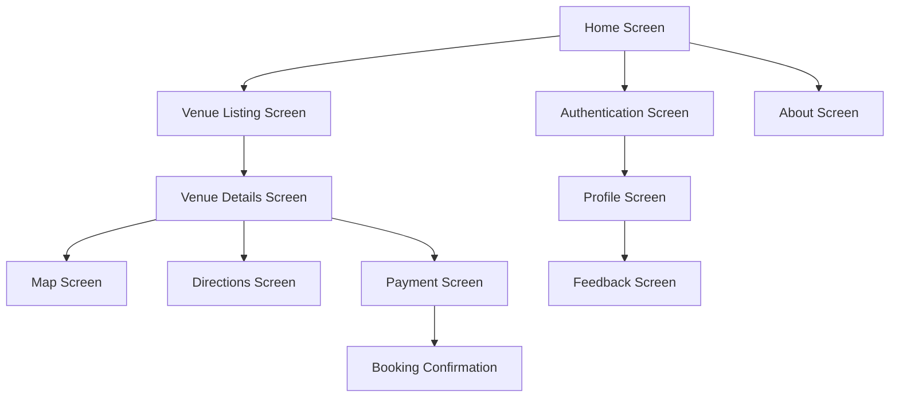

# Vow Venues React Native Android Conversion - Product Requirements Document

## 1. Product Overview

Convert the existing Vow Venues web application into a fully functional React Native Android mobile app, preserving all features and functionalities while optimizing for mobile user experience. The mobile app will serve as a comprehensive venue booking platform that allows users to discover, explore, and book wedding venues in Peshawar with integrated payment solutions and location services.

The target is to deliver a production-ready mobile application that maintains the same database connections, user workflows, and business logic as the web version while providing an enhanced mobile-first experience.

## 2. Core Features

### 2.1 User Roles

| Role            | Registration Method         | Core Permissions                                                   |
| --------------- | --------------------------- | ------------------------------------------------------------------ |
| Guest User      | No registration required    | Can browse venues, view details, access maps and directions        |
| Registered User | Email/username registration | Can book venues, make payments, provide feedback, save favorites   |
| Venue Owner     | Admin invitation/approval   | Can manage venue listings, view bookings, update venue information |

### 2.2 Feature Module

Our React Native venue booking app consists of the following main screens:

1. **Home Screen**: Hero section with search functionality, featured venues carousel, quick navigation menu
2. **Venue Listing Screen**: Filterable venue grid, search bar, sorting options, venue cards with key information
3. **Venue Details Screen**: Image gallery, detailed information, booking form, contact options, map integration
4. **Map Screen**: Interactive venue location display, directions integration, nearby venues
5. **Directions Screen**: Turn-by-turn navigation, distance and time estimates, alternative routes
6. **Authentication Screen**: Login/register forms, password recovery, social authentication options
7. **Payment Screen**: Integrated payment gateway (EasyPaisa, JazzCash), booking confirmation, receipt generation
8. **About Screen**: Company information, contact details, terms and conditions
9. **Feedback Screen**: User review system, rating submission, feedback history
10. **Profile Screen**: User account management, booking history, saved venues

### 2.3 Page Details

| Screen Name       | Module Name        | Feature Description                                                          |
| ----------------- | ------------------ | ---------------------------------------------------------------------------- |
| Home Screen       | Hero Section       | Display banner with search bar, featured venue carousel with auto-scroll     |
| Home Screen       | Quick Actions      | Navigation buttons for venues, bookings, profile, and emergency contact      |
| Home Screen       | Featured Venues    | Horizontal scrollable list of top-rated venues with images and basic info    |
| Venue Listing     | Search & Filter    | Text search, capacity filter, price range slider, location-based filtering   |
| Venue Listing     | Venue Grid         | Responsive grid layout with venue cards showing image, name, capacity, price |
| Venue Listing     | Sort Options       | Sort by price, capacity, rating, distance, availability                      |
| Venue Details     | Image Gallery      | Full-screen image viewer with swipe navigation, zoom functionality           |
| Venue Details     | Information Panel  | Display venue details, amenities, contact info, availability calendar        |
| Venue Details     | Booking Form       | Date selection, guest count, special requirements, instant booking           |
| Venue Details     | Contact Actions    | Call venue, email inquiry, WhatsApp integration, save to favorites           |
| Map Screen        | Interactive Map    | Google Maps integration with venue markers, current location, zoom controls  |
| Map Screen        | Venue Markers      | Clickable markers showing venue info popup, navigation to details            |
| Directions Screen | Navigation         | Turn-by-turn directions, real-time traffic, alternative route suggestions    |
| Directions Screen | Route Info         | Distance, estimated time, traffic conditions, sharing options                |
| Authentication    | Login Form         | Username/email and password fields, remember me option, biometric login      |
| Authentication    | Registration       | User details form, email verification, terms acceptance                      |
| Authentication    | Password Recovery  | Email-based password reset, security questions, OTP verification             |
| Payment Screen    | Payment Gateway    | EasyPaisa and JazzCash integration, secure payment processing                |
| Payment Screen    | Booking Summary    | Venue details, booking dates, total cost, discount application               |
| Payment Screen    | Receipt Generation | PDF receipt creation, email delivery, booking confirmation                   |
| About Screen      | Company Info       | Mission, vision, team information, contact details                           |
| About Screen      | Support            | FAQ section, help center, customer service contact                           |
| Feedback Screen   | Review System      | Star rating, written reviews, photo uploads, review moderation               |
| Feedback Screen   | Feedback History   | User's previous reviews, edit/delete options, response tracking              |
| Profile Screen    | Account Management | Profile editing, password change, notification preferences                   |
| Profile Screen    | Booking History    | Past and upcoming bookings, cancellation options, rebooking                  |
| Profile Screen    | Saved Venues       | Favorite venues list, quick booking, sharing options                         |

## 3. Core Process

### Guest User Flow

1. User opens the app and lands on Home Screen
2. Browse featured venues or use search functionality
3. Navigate to Venue Listing Screen with filters
4. Select a venue to view Venue Details Screen
5. View venue images, information, and location on Map Screen
6. Get Directions to venue if needed
7. Prompted to register/login for booking functionality

### Registered User Flow

1. User logs in through Authentication Screen
2. Access full app functionality including booking
3. Select venue and fill Booking Form on Venue Details Screen
4. Proceed to Payment Screen for transaction
5. Complete payment through integrated gateway
6. Receive booking confirmation and receipt
7. Access booking history through Profile Screen
8. Provide feedback through Feedback Screen after event

### Venue Owner Flow

1. Login with owner credentials
2. Access venue management dashboard
3. Update venue information, images, and availability
4. View and manage incoming bookings
5. Respond to customer inquiries and reviews

## 4. User Interface Design

### 4.1 Design Style

* **Primary Colors**:

  * Primary: #8B5CF6 (Purple) - for main actions and branding

  * Secondary: #10B981 (Emerald) - for success states and confirmations

  * Accent: #F59E0B (Amber) - for highlights and warnings

* **Background Colors**:

  * Light: #FFFFFF (White) - main background

  * Gray: #F9FAFB (Light Gray) - secondary backgrounds

  * Dark: #1F2937 (Dark Gray) - text and borders

* **Button Style**: Rounded corners (8px radius), elevated shadow, gradient backgrounds for primary actions

* **Typography**:

  * Primary: Inter font family

  * Headings: 18-24px, semi-bold

  * Body text: 14-16px, regular

  * Captions: 12px, medium

* **Layout Style**: Card-based design with consistent spacing (16px margins), bottom tab navigation, floating action buttons

* **Icons**: Lucide React icons with consistent 24px size, outlined style for better mobile visibility

### 4.2 Screen Design Overview

| Screen Name    | Module Name     | UI Elements                                                                         |
| -------------- | --------------- | ----------------------------------------------------------------------------------- |
| Home Screen    | Hero Section    | Full-width banner image, overlay search bar, gradient background, animated carousel |
| Home Screen    | Navigation      | Bottom tab bar with icons, floating search button, notification badge               |
| Venue Listing  | Filter Bar      | Horizontal scrollable filter chips, sort dropdown, map toggle button                |
| Venue Listing  | Venue Cards     | Elevated cards with rounded corners, hero image, overlay text, favorite heart icon  |
| Venue Details  | Image Gallery   | Full-screen modal, page indicators, zoom gestures, share button                     |
| Venue Details  | Info Sections   | Collapsible accordions, icon-text pairs, call-to-action buttons                     |
| Map Screen     | Map Interface   | Full-screen Google Maps, custom venue markers, location FAB, zoom controls          |
| Authentication | Form Design     | Floating label inputs, social login buttons, biometric prompt, brand colors         |
| Payment Screen | Payment Options | Radio button selection, secure badges, progress indicator, summary card             |
| Profile Screen | User Interface  | Avatar upload, list items with icons, toggle switches, logout button                |

### 4.3 Responsiveness

The React Native app is designed mobile-first with adaptive layouts for different Android screen sizes:

* **Phone Optimization**: Portrait orientation primary, landscape support for media viewing

* **Tablet Support**: Responsive grid layouts, side navigation for larger screens

* **Touch Interactions**: Minimum 44px touch targets, swipe gestures, pull-to-refresh functionality

* **Accessibility**: Screen reader support, high contrast mode, scalable text sizes

* **Performance**: Optimized images, lazy loading, efficient list rendering with FlatList components

