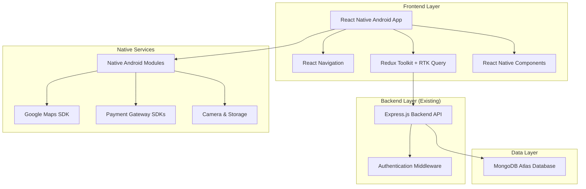
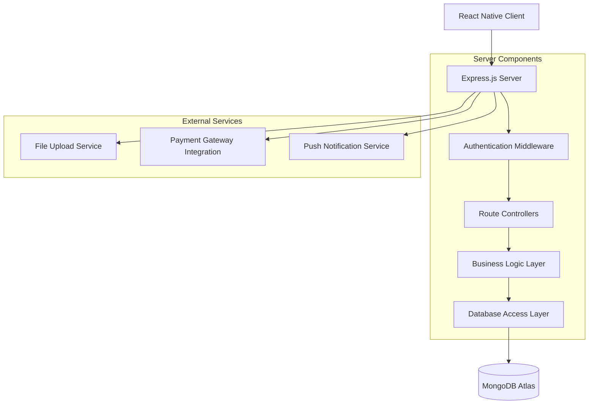
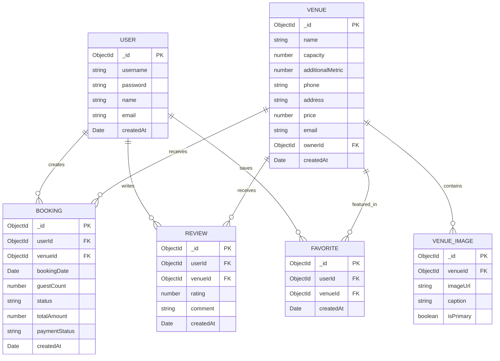

# Vow Venues React Native Android - Technical Architecture Document

## 1. Architecture Design



## 2. Technology Description

* **Frontend**: React Native\@0.73 + TypeScript\@5.6 + React Navigation\@6

* **State Management**: Redux Toolkit + RTK Query for API state management

* **UI Components**: React Native Elements + Custom components (converted from Radix UI)

* **Styling**: StyleSheet API + React Native Vector Icons

* **Backend**: Existing Express.js\@4.21 server (no changes required)

* **Database**: MongoDB Atlas (existing connection preserved)

* **Authentication**: Existing Passport.js + JWT tokens

* **Maps**: React Native Maps + Google Maps SDK

* **Payments**: Native payment gateway integrations (EasyPaisa, JazzCash)

* **Build Tools**: Metro bundler + Gradle for Android builds

## 3. Route Definitions

| Route           | Purpose                          | Web Equivalent        |
| --------------- | -------------------------------- | --------------------- |
| HomeStack       | Home screen with venue discovery | /                     |
| VenueStack      | Venue listing and search         | /venues               |
| VenueDetails    | Individual venue information     | /venue/:id            |
| VenueMap        | Map view of venue location       | /venue/:id/map        |
| VenueDirections | Navigation to venue              | /venue/:id/directions |
| PaymentScreen   | Booking and payment processing   | /venue/:id/payment    |
| AuthStack       | Login and registration           | /auth                 |
| ProfileStack    | User account management          | /profile              |
| AboutScreen     | Company information              | /about                |
| FeedbackScreen  | User reviews and feedback        | /feedback             |

## 4. API Definitions

### 4.1 Core API Endpoints (Existing Backend)

**Authentication APIs**

```
POST /api/auth/login
```

Request:

| Param Name | Param Type | isRequired | Description              |
| ---------- | ---------- | ---------- | ------------------------ |
| username   | string     | true       | User's username or email |
| password   | string     | true       | User's password          |

Response:

| Param Name | Param Type | Description              |
| ---------- | ---------- | ------------------------ |
| success    | boolean    | Authentication status    |
| user       | object     | User information         |
| token      | string     | JWT authentication token |

**Venue Management APIs**

```
GET /api/venues
```

Response:

| Param Name | Param Type | Description        |
| ---------- | ---------- | ------------------ |
| venues     | array      | List of all venues |
| total      | number     | Total venue count  |

```
GET /api/venues/:id
```

Response:

| Param Name | Param Type | Description                |
| ---------- | ---------- | -------------------------- |
| venue      | object     | Detailed venue information |
| images     | array      | Venue image URLs           |

**Booking APIs**

```
POST /api/bookings
```

Request:

| Param Name      | Param Type | isRequired | Description               |
| --------------- | ---------- | ---------- | ------------------------- |
| venueId         | string     | true       | Venue identifier          |
| date            | string     | true       | Booking date (ISO format) |
| guestCount      | number     | true       | Number of guests          |
| specialRequests | string     | false      | Additional requirements   |

### 4.2 Mobile-Specific API Extensions

**File Upload API**

```
POST /api/upload/image
```

Request: FormData with image file
Response: Image URL and metadata

**Push Notification API**

```
POST /api/notifications/register
```

Request: FCM token registration
Response: Registration confirmation

## 5. Server Architecture Diagram



## 6. Data Model

### 6.1 Data Model Definition



### 6.2 Data Definition Language

**Existing Tables (Preserved)**

```javascript
// User Collection
const userSchema = new Schema({
  username: { type: String, required: true, unique: true },
  password: { type: String, required: true },
  name: { type: String, required: true },
  email: { type: String, required: true },
  createdAt: { type: Date, default: Date.now }
});

// Venue Collection
const venueSchema = new Schema({
  name: { type: String, required: true },
  capacity: { type: Number, required: true },
  additionalMetric: { type: Number },
  phone: { type: String, required: true },
  address: { type: String, required: true },
  price: { type: Number, required: true },
  email: { type: String },
  ownerId: { type: Schema.Types.ObjectId, ref: 'User' },
  createdAt: { type: Date, default: Date.now }
});
```

**New Collections for Mobile Features**

```javascript
// Booking Collection
const bookingSchema = new Schema({
  userId: { type: Schema.Types.ObjectId, ref: 'User', required: true },
  venueId: { type: Schema.Types.ObjectId, ref: 'Venue', required: true },
  bookingDate: { type: Date, required: true },
  guestCount: { type: Number, required: true },
  status: { type: String, enum: ['pending', 'confirmed', 'cancelled'], default: 'pending' },
  totalAmount: { type: Number, required: true },
  paymentStatus: { type: String, enum: ['pending', 'completed', 'failed'], default: 'pending' },
  specialRequests: { type: String },
  createdAt: { type: Date, default: Date.now }
});

// Review Collection
const reviewSchema = new Schema({
  userId: { type: Schema.Types.ObjectId, ref: 'User', required: true },
  venueId: { type: Schema.Types.ObjectId, ref: 'Venue', required: true },
  rating: { type: Number, min: 1, max: 5, required: true },
  comment: { type: String, required: true },
  createdAt: { type: Date, default: Date.now }
});

// Venue Images Collection
const venueImageSchema = new Schema({
  venueId: { type: Schema.Types.ObjectId, ref: 'Venue', required: true },
  imageUrl: { type: String, required: true },
  caption: { type: String },
  isPrimary: { type: Boolean, default: false },
  createdAt: { type: Date, default: Date.now }
});

// Favorites Collection
const favoriteSchema = new Schema({
  userId: { type: Schema.Types.ObjectId, ref: 'User', required: true },
  venueId: { type: Schema.Types.ObjectId, ref: 'Venue', required: true },
  createdAt: { type: Date, default: Date.now }
});
```

**Halls.txt Integration**

```javascript
// Import script for halls.txt data
const importHallsData = async () => {
  const hallsData = [
    {
      name: "monal marquee peshawar",
      capacity: 800,
      additionalMetric: 100,
      phone: "091-7242223",
      address: "sahibzadagul Road Peshawar",
      price: 200000
    },
    {
      name: "Imperial Grand Banquet Hall",
      capacity: 1500,
      additionalMetric: 200,
      phone: "0345-1112223",
      address: "Plot No. 10, Phase 8, Hayatabad, Peshawar",
      price: 500000,
      email: "info@imperialgrand.pk"
    }
    // ... additional venues from halls.txt
  ];
  
  await Venue.insertMany(hallsData);
};
```

## 7. Component Mapping (Web to React Native)

| Web Component           | React Native Equivalent | Key Changes                      |
| ----------------------- | ----------------------- | -------------------------------- |
| `<div>`                 | `<View>`                | Container component              |
| `<span>`, `<p>`         | `<Text>`                | Text rendering                   |
| ``                 | `<Image>`               | Image component with source prop |
| `<button>`              | `<TouchableOpacity>`    | Touch-based interaction          |
| `<input>`               | `<TextInput>`           | Text input with mobile keyboard  |
| `<a>` (navigation)      | `navigation.navigate()` | Programmatic navigation          |
| CSS classes             | StyleSheet objects      | Style definitions                |
| Radix UI components     | React Native Elements   | UI component library             |
| Wouter routing          | React Navigation        | Stack and tab navigation         |
| `useState`, `useEffect` | Same hooks              | React hooks preserved            |
| Tailwind CSS            | StyleSheet + constants  | Style system conversion          |

## 8. Mobile-Specific Implementations

### 8.1 Navigation Structure

```javascript
// Main navigation stack
const RootStack = createStackNavigator();
const Tab = createBottomTabNavigator();

const TabNavigator = () => (
  <Tab.Navigator>
    <Tab.Screen name="Home" component={HomeScreen} />
    <Tab.Screen name="Venues" component={VenueListScreen} />
    <Tab.Screen name="Bookings" component={BookingsScreen} />
    <Tab.Screen name="Profile" component={ProfileScreen} />
  </Tab.Navigator>
);
```

### 8.2 State Management

```javascript
// Redux store configuration
const store = configureStore({
  reducer: {
    auth: authSlice.reducer,
    venues: venuesSlice.reducer,
    bookings: bookingsSlice.reducer,
    api: apiSlice.reducer
  },
  middleware: (getDefaultMiddleware) =>
    getDefaultMiddleware().concat(apiSlice.middleware)
});
```

### 8.3 Performance Optimizations

* **Image Optimization**: React Native Fast Image for caching

* **List Performance**: FlatList with getItemLayout for large datasets

* **Memory Management**: Image resizing and lazy loading

* **Bundle Optimization**: Code splitting and dynamic imports

* **Network Optimization**: Request caching and offline support

